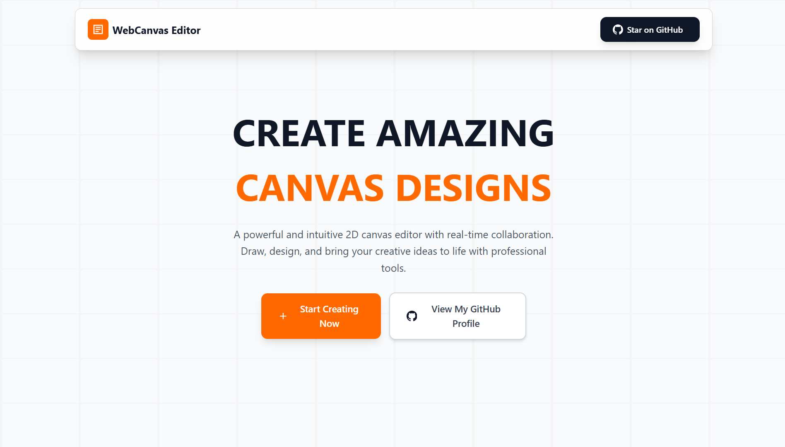
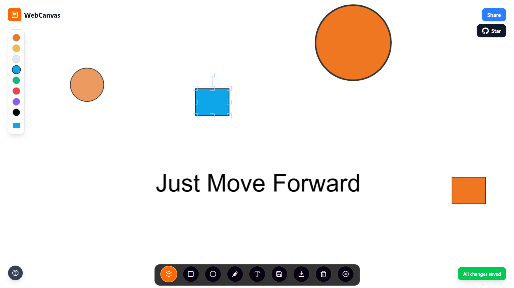
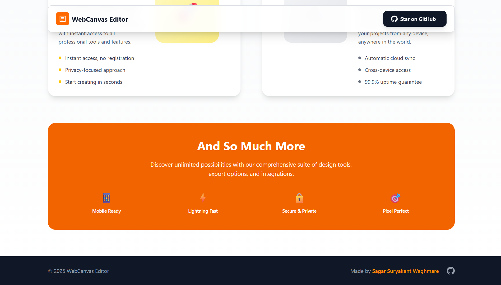
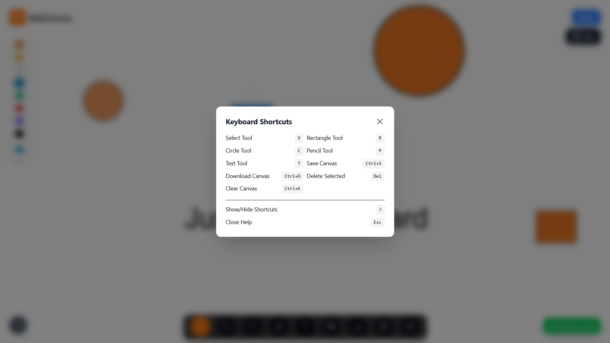
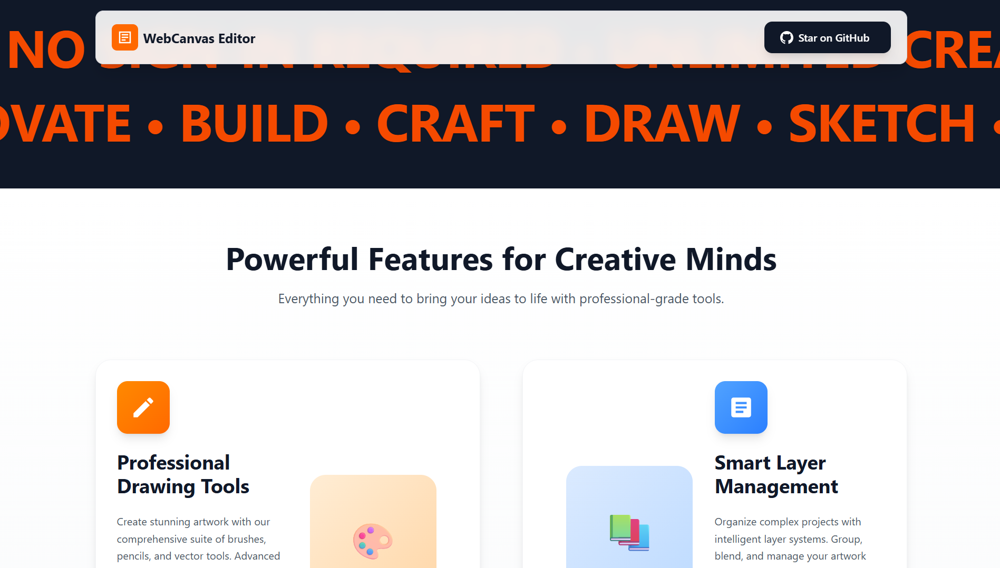

# 🎨 WebCanvas Editor# React + Vite


A modern, feature-rich online canvas editor built with React, Vite, and Fabric.js. Create, edit, and share your digital artwork with an intuitive interface and powerful drawing tools.This template provides a minimal setup to get React working in Vite with HMR and some ESLint rules.


Currently, two official plugins are available:


## 🚀 Features- [@vitejs/plugin-react](https://github.com/vitejs/vite-plugin-react/blob/main/packages/plugin-react) uses [Babel](https://babeljs.io/) (or [oxc](https://oxc.rs) when used in [rolldown-vite](https://vite.dev/guide/rolldown)) for Fast Refresh

- [@vitejs/plugin-react-swc](https://github.com/vitejs/vite-plugin-react/blob/main/packages/plugin-react-swc) uses [SWC](https://swc.rs/) for Fast Refresh

### 🎯 Core Drawing Tools

- **Selection Tool** - Select and manipulate objects## React Compiler

- **Rectangle Tool** - Create rectangular shapes  

- **Circle Tool** - Draw perfect circlesThe React Compiler is not enabled on this template because of its impact on dev & build performances. To add it, see [this documentation](https://react.dev/learn/react-compiler/installation).

- **Pencil Tool** - Freehand drawing with adjustable brush size

- **Text Tool** - Add and edit text with custom styling## Expanding the ESLint configuration


If you are developing a production application, we recommend using TypeScript with type-aware lint rules enabled. Check out the [TS template](https://github.com/vitejs/vite/tree/main/packages/create-vite/template-react-ts) for information on how to integrate TypeScript and [`typescript-eslint`](https://typescript-eslint.io) in your project.


### ⚡ Advanced Features
- **Real-time Autosave** - Automatically saves your work every 5 seconds
- **Download Canvas** - Export your artwork as high-quality PNG
- **Share Functionality** - Generate shareable links instantly
- **Responsive Design** - Works seamlessly on desktop, tablet, and mobile
- **Toast Notifications** - User-friendly feedback system
- **Undo/Redo Support** - Full canvas history management



### ⌨️ Keyboard Shortcuts
- **V** - Select Tool
- **R** - Rectangle Tool
- **C** - Circle Tool
- **P** - Pencil Tool
- **T** - Text Tool
- **Ctrl+S** - Save Canvas
- **Ctrl+D** - Download Canvas
- **Ctrl+K** - Clear Canvas (with confirmation)
- **Delete/Backspace** - Delete Selected Object
- **?** - Show/Hide Keyboard Shortcuts
- **Escape** - Close Help Panel



### 🎨 User Interface
- **Floating Dock** - Modern macOS-style tool dock with hover effects
- **Color Picker** - Vertical color palette with custom color support
- **Brush Controls** - Adjustable brush size for pencil tool
- **Help System** - Built-in keyboard shortcuts reference
- **Status Indicators** - Real-time save status and notifications



## 🛠️ Tech Stack

- **Frontend Framework:** React 18
- **Build Tool:** Vite
- **Canvas Library:** Fabric.js
- **Styling:** Tailwind CSS
- **UI Components:** Magic UI
- **Animations:** Framer Motion
- **Backend:** Firebase (for canvas storage)
- **Routing:** React Router DOM

## 📦 Installation

1. **Clone the repository**
   ```bash
   git clone https://github.com/SagarSuryakantWaghmare/webcanvas-editor.git
   cd webcanvas-editor
   ```

2. **Install dependencies**
   ```bash
   npm install
   ```

3. **Set up Firebase**
   - Create a Firebase project at [Firebase Console](https://console.firebase.google.com/)
   - Enable Firestore Database
   - Copy your Firebase configuration
   - Create a `.env` file in the root directory:
   ```env
   VITE_FIREBASE_API_KEY=your_api_key_here
   VITE_FIREBASE_AUTH_DOMAIN=your_auth_domain_here
   VITE_FIREBASE_PROJECT_ID=your_project_id_here
   VITE_FIREBASE_STORAGE_BUCKET=your_storage_bucket_here
   VITE_FIREBASE_MESSAGING_SENDER_ID=your_messaging_sender_id_here
   VITE_FIREBASE_APP_ID=your_app_id_here
   ```

4. **Start the development server**
   ```bash
   npm run dev
   ```

5. **Build for production**
   ```bash
   npm run build
   ```

## 🚀 Usage

### Creating a New Canvas
1. Visit the homepage
2. Click "Start Drawing" to create a new canvas
3. Your canvas will be automatically assigned a unique ID
4. Share the URL to collaborate or save for later

### Drawing and Editing
1. Select tools from the floating dock at the bottom
2. Use keyboard shortcuts for quick tool switching
3. Adjust colors using the vertical color picker
4. Modify brush size when using the pencil tool
5. Your work is automatically saved every 5 seconds

### Keyboard Shortcuts
- Press **?** to view all available keyboard shortcuts
- Use **Ctrl+S** to manually save your canvas
- Press **Ctrl+K** to clear the canvas (with confirmation)
- Use **Delete** to remove selected objects

## 🎨 Canvas Features

### Drawing Tools
- **Freehand Drawing**: Natural pencil tool with pressure sensitivity
- **Shape Creation**: Perfect rectangles and circles
- **Text Editing**: Click to add and edit text directly on canvas
- **Object Manipulation**: Move, resize, and rotate any object

### Canvas Management
- **Auto-save**: Prevents data loss with automatic saving
- **Export Options**: High-quality PNG download
- **Responsive Canvas**: Adapts to any screen size
- **Zoom and Pan**: Navigate large canvases easily

## 🤝 Contributing

Contributions are welcome! Here's how you can help:

1. **Fork the repository**
2. **Create a feature branch**
   ```bash
   git checkout -b feature/amazing-feature
   ```
3. **Commit your changes**
   ```bash
   git commit -m 'Add some amazing feature'
   ```
4. **Push to the branch**
   ```bash
   git push origin feature/amazing-feature
   ```
5. **Open a Pull Request**

## 📝 License

This project is licensed under the MIT License - see the [LICENSE](LICENSE) file for details.

## 👨‍💻 Author

**Sagar Suryakant Waghmare**
- GitHub: [@SagarSuryakantWaghmare](https://github.com/SagarSuryakantWaghmare)
- LinkedIn: [Sagar Waghmare](https://www.linkedin.com/in/sagar-waghmare/)
- Portfolio: [Your Portfolio Website](https://your-portfolio-website.com)

## 🙏 Acknowledgments

- [Fabric.js](http://fabricjs.com/) - Powerful canvas library
- [React](https://reactjs.org/) - Frontend framework
- [Vite](https://vitejs.dev/) - Fast build tool
- [Tailwind CSS](https://tailwindcss.com/) - Utility-first CSS framework
- [Firebase](https://firebase.google.com/) - Backend services
- [Magic UI](https://magicui.design/) - Beautiful UI components

## 📊 Project Status

🟢 **Active Development** - This project is actively maintained and regularly updated with new features.

### Recent Updates
- ✅ Mobile responsiveness improvements
- ✅ Keyboard shortcuts system
- ✅ Clear canvas modal
- ✅ Enhanced dock tooltips
- ✅ Auto-save functionality
- ✅ Toast notification system

### Planned Features
- 🔄 Layer management system
- 🔄 Advanced shape tools (polygon, star, etc.)
- 🔄 Image import functionality
- 🔄 Collaboration features
- 🔄 Canvas templates
- 🔄 Export to multiple formats (SVG, PDF)


⭐ **Star this repository if you find it helpful!**

[](https://github.com/SagarSuryakantWaghmare/webcanvas-editor)
[](https://github.com/SagarSuryakantWaghmare/webcanvas-editor/fork)
[](https://github.com/SagarSuryakantWaghmare/webcanvas-editor/issues)

Made with ❤️ by [Sagar Suryakant Waghmare](https://github.com/SagarSuryakantWaghmare)